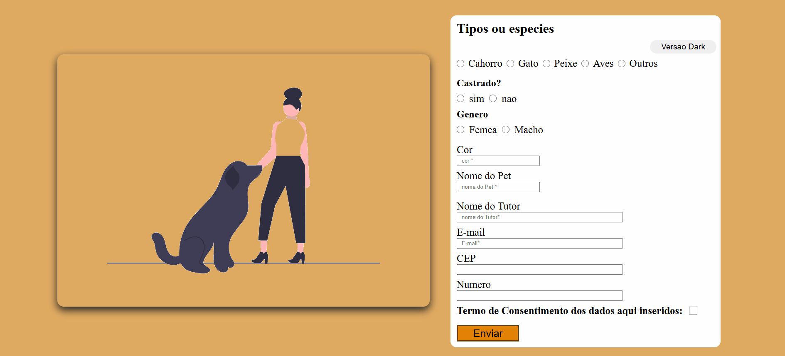

# Projeto


## Sobre
Este é um simples projeto de formulário de cadastro para pets que permite ao usuário alternar entre dois temas: claro e escuro (dark mode). O formulário coleta dados sobre o pet, como tipo, nome, cor, além de informações do tutor, como nome e e-mail.

## Funcionalidades
- Modo claro e modo escuro: Através de um botão, o usuário pode alternar entre dois temas de cores para a página (versão clara e versão escura).

- Formulário de cadastro: O usuário pode preencher informações sobre o pet, como tipo de animal, se é castrado, o gênero, cor, nome do pet e dados do tutor.

- Interatividade: O JavaScript é usado para realizar a alteração de tema e para garantir a interação dinâmica da página.

## Como Usar
``` bash
git clone https://github.com/dorffdaniel/formulario1
```
1. Abra o arquivo `index.html` no seu navegador.
2. Preencha os campos do formulário conforme necessário.
3. Clique no botão "Versão Dark" para alternar entre os temas claro e escuro.

## Tecnologias Usadas
HTML: Para estruturação da página. <br>
CSS: Para estilizar a página e criar a alternância de tema. <br>
JavaScript: Para adicionar interatividade e alternar entre os temas.

## Contato
[linkedin](https://www.linkedin.com/in/daniel-alves-9872392a7/)
